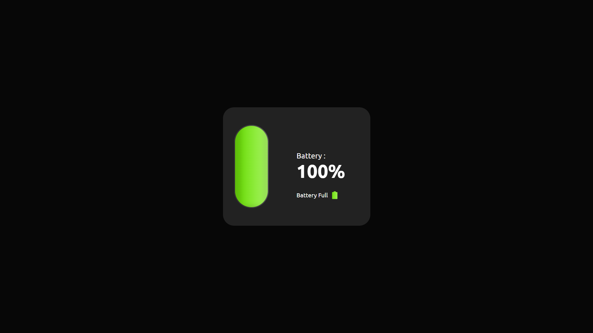

# Project #05

### Detect Device Battery
I am gonna showing to you how to detect user device battery with javascript. you can use this online javascript battery detector to detect user device battery and detect if it's plugged charger or no❗️

# Screenshot
Here i have project screenshot :

