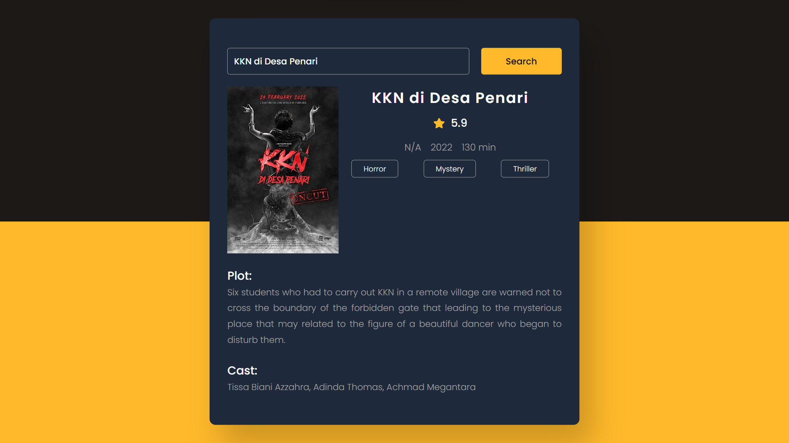

# Project #11

### Movie Info App
I am gonna showing to you how to code a movie info app with javascript. in this project also i use a movie database api and i get data from api and this code is also responsive❗️

## Warning
You need to get your own api key and replace it in key.js file :

```javascript
key = "Your Api Key";
```


# Screenshot
Here i have project screenshot :


