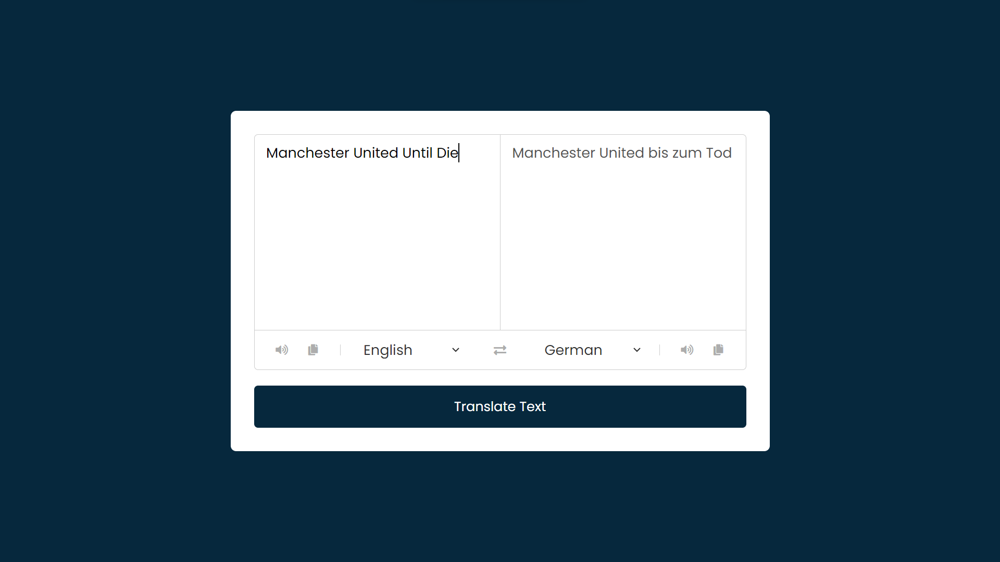

# Project #13

### Translator App
I am gonna showing to you how to code a translator app with javascript. in this tutorial also i use a translate api and i get data from api and this code is also responsive❗️
in this project i have a google translate clone

# Screenshot
Here i have project screenshot :

