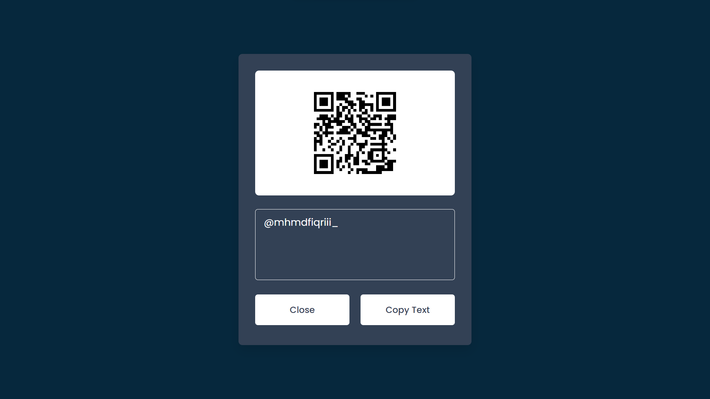

# Project #20

### QR Code Reader
I am gonna showing to you how to build a QR Code Reader with javascript. this qr code reader also use QR Reader api and you can read qr codes that i generate with day #4 of 100 days❗️

#### Day #4 Link

<a href="https://github.com/permenkojek/just-javascript/tree/main/Project%20%2304%20-%20%20QR%20Code%20Generator" target="_blank">QR Code Generator Source</a>

# Screenshot
Here i have project screenshot :

