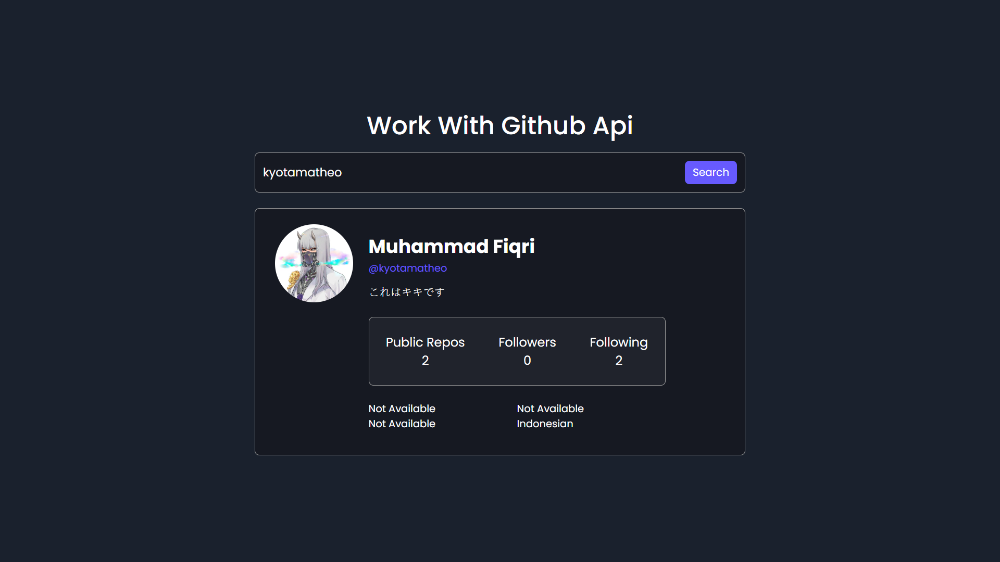

# Project #30

### Music Player App
In this tutorial ([Open in Youtube](https://youtu.be/KndQpfPkOOY)),  I am gonna showing to you how to code a music player in javascript. i create a project that you can play audio files with javascript from local folder or any url❗️

# Screenshot
Here i have project screenshot :

