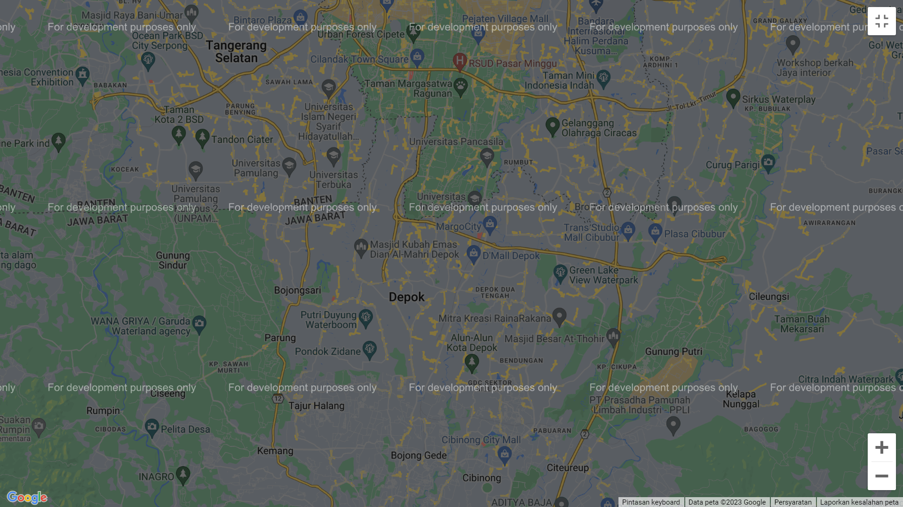

# Project #32

### Google Maps
I am gonna showing to you how to use google maps api in javascript. i create a project that you can work with google map in javascript❗️Also this project is full responsive!

# Screenshot
Here i have project screenshot :

