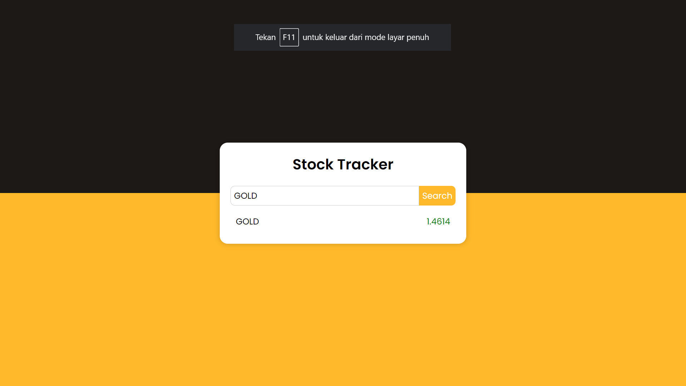

# Project #36


### Movie App (TheMovieDB)
I am gonna showing to you how to code a Movie App using JavaScript. in this project i'm using TheMovieDB api to get movies info. Also this code is fully responsive and when you scroll it will load more results❗️

## Warning
You need to get your own api key and replace it in index.js file on line 1 :

```javascript
const apiKey = "YOUR_API_KEY";
```

# Screenshot
Here i have project screenshot :


