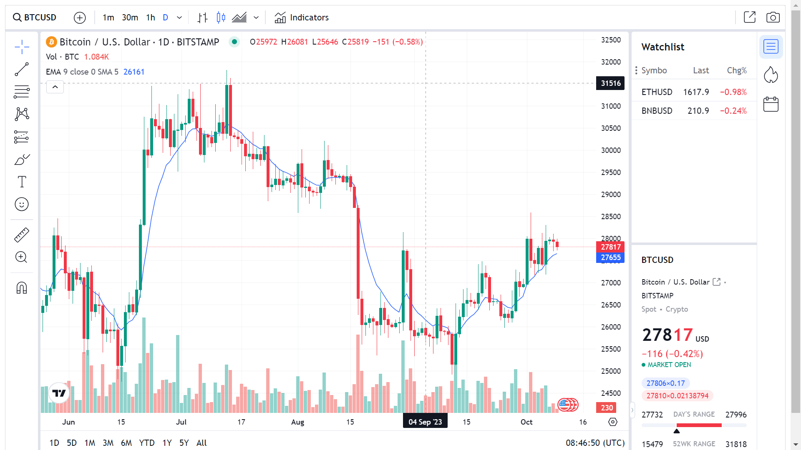

# Project #39

### Tradingview Widget
I am gonna showing to you how to use tradingview widget api in javascript. Also this code is fully responsive and i show you 2 method of coding for it❗️

# Screenshot
Here i have project screenshot :

