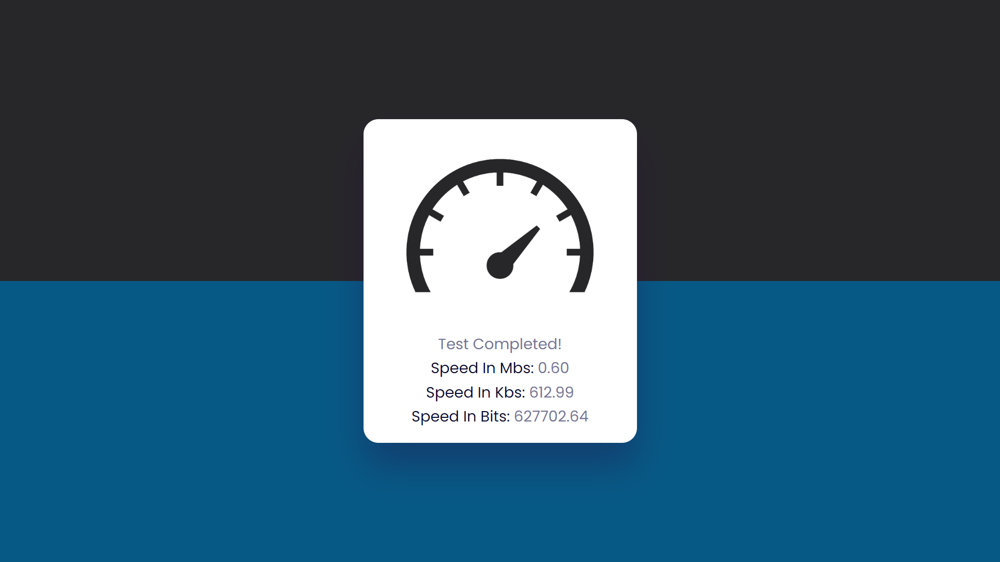

# Project #40

### Detect Internet Speed
I am gonna showing to you how to code a Internet Speed Test using JavaScript. in this project i Detect Internet Speed with downloading images from unsplash api and calculating image download time depending on it's size❗️

# Screenshot
Here i have project screenshot :

