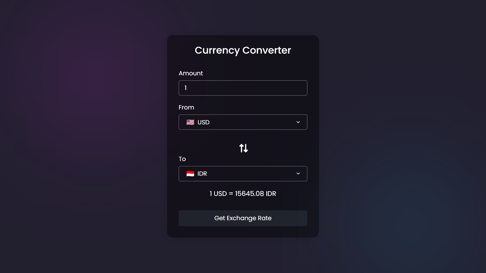

# Project #41

### Currency Converter

I am gonna showing to you how to code a currency converter using JavaScript with api. in this project i'm using exchangerate-api to get exchange rates. Also this code is fully responsive and i used a flag icons api in this project❗️

## Warning
You need to get your own api key and replace it in index.js file on line 28 :

```javascript
const response = await fetch(`https://v6.exchangerate-api.com/v6/[YOUR_KEY]]/latest/${fromCur.value}`);
```


# Screenshot
Here i have project screenshot :


