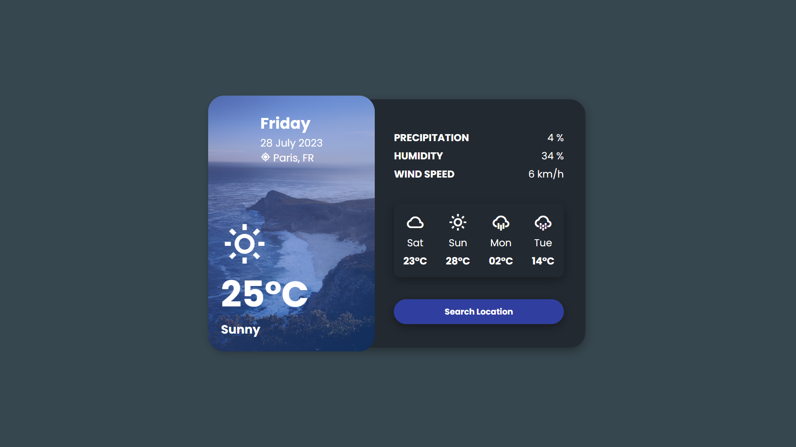

# Project #44

### Minimal Weather App
I am gonna showing to you how to add api to Minimal Weather App Ui Design, i'm used openweather api to connect this app to api to get weather info❗️

## Warning
You need to get your own api key and replace it in index.js file on line 1 :

```javascript
const apiKey = 'YOUR_API_KEY';
```

# Screenshot
Here i have project screenshot :


