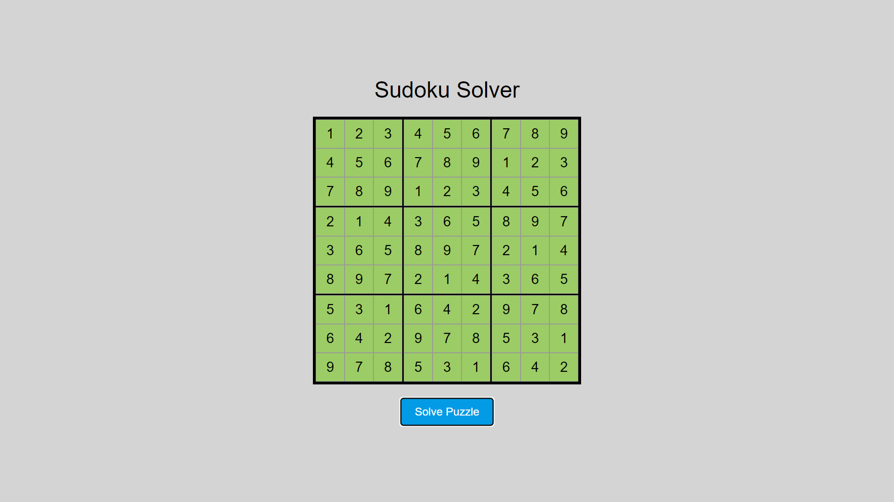

# Day #46

### Sudoku Solver
I am gonna showing to you how to code a Sudoku Solver with JavaScript. With this code you can solve any sudoku puzzles! just input numbers then click on solve puzzle❗️

# Screenshot
Here we have project screenshot :

